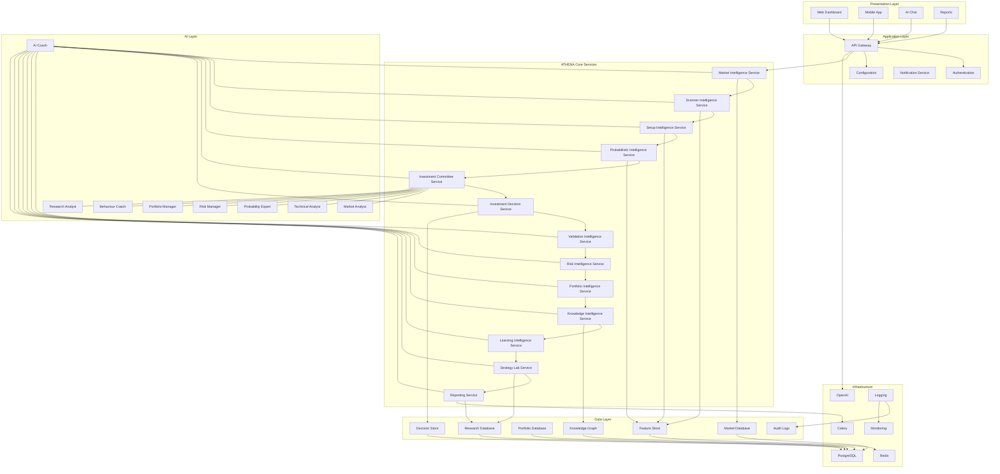

# ATHENA Reference Architecture

```mermaid
flowchart TB

%% ==========================
%% USER LAYER
%% ==========================

subgraph USER["Presentation Layer"]
U1["Web Dashboard"]
U2["Mobile App"]
U3["AI Chat"]
U4["Reports"]
end

%% ==========================
%% APPLICATION LAYER
%% ==========================

subgraph APP["Application Layer"]

API["API Gateway"]

AUTH["Authentication"]

CONFIG["Configuration"]

NOTIFY["Notification Service"]

end

%% ==========================
%% CORE SERVICES
%% ==========================

subgraph CORE["ATHENA Core Services"]

MKT["Market Intelligence Service"]

SCAN["Scanner Intelligence Service"]

SETUP["Setup Intelligence Service"]

PROB["Probabilistic Intelligence Service"]

COMMITTEE["Investment Committee Service"]

DECISION["Investment Decision Service"]

VALIDATION["Validation Intelligence Service"]

RISK["Risk Intelligence Service"]

PORT["Portfolio Intelligence Service"]

KNOWLEDGE["Knowledge Intelligence Service"]

LEARNING["Learning Intelligence Service"]

LAB["Strategy Lab Service"]

REPORT["Reporting Service"]

end

%% ==========================
%% AI LAYER
%% ==========================

subgraph AI["AI Layer"]

COACH["AI Coach"]

MARKET_AGENT["Market Analyst"]

TECH_AGENT["Technical Analyst"]

PROB_AGENT["Probability Expert"]

RISK_AGENT["Risk Manager"]

PORT_AGENT["Portfolio Manager"]

BEHAVIOR_AGENT["Behaviour Coach"]

RESEARCH_AGENT["Research Analyst"]

end

%% ==========================
%% DATA LAYER
%% ==========================

subgraph DATA["Data Layer"]

FEATURE["Feature Store"]

MARKETDB["Market Database"]

PORTDB["Portfolio Database"]

KNOWLEDGEGRAPH["Knowledge Graph"]

RESEARCHDB["Research Database"]

EVENTSTORE["Decision Store"]

AUDIT["Audit Logs"]

end

%% ==========================
%% INFRASTRUCTURE
%% ==========================

subgraph INFRA["Infrastructure"]

POSTGRES["PostgreSQL"]

REDIS["Redis"]

CELERY["Celery"]

OPENAI["OpenAI"]

MONITOR["Monitoring"]

LOGGER["Logging"]

end

%% ==========================
%% FLOW
%% ==========================

U1 --> API
U2 --> API
U3 --> API
U4 --> API

API --> AUTH
API --> CONFIG

API --> MKT

MKT --> SCAN

SCAN --> SETUP

SETUP --> PROB

PROB --> COMMITTEE

COMMITTEE --> DECISION

DECISION --> VALIDATION

VALIDATION --> RISK

RISK --> PORT

PORT --> KNOWLEDGE

KNOWLEDGE --> LEARNING

LEARNING --> LAB

LAB --> REPORT

%% ==========================
%% AI
%% ==========================

COACH --- MKT
COACH --- SCAN
COACH --- SETUP
COACH --- PROB
COACH --- COMMITTEE
COACH --- DECISION
COACH --- VALIDATION
COACH --- RISK
COACH --- PORT
COACH --- KNOWLEDGE
COACH --- LEARNING
COACH --- LAB
COACH --- REPORT

COMMITTEE --- MARKET_AGENT
COMMITTEE --- TECH_AGENT
COMMITTEE --- PROB_AGENT
COMMITTEE --- RISK_AGENT
COMMITTEE --- PORT_AGENT
COMMITTEE --- BEHAVIOR_AGENT
COMMITTEE --- RESEARCH_AGENT

%% ==========================
%% DATA
%% ==========================

MKT --> MARKETDB

SCAN --> FEATURE

SETUP --> FEATURE

PROB --> FEATURE

DECISION --> EVENTSTORE

KNOWLEDGE --> KNOWLEDGEGRAPH

LAB --> RESEARCHDB

REPORT --> RESEARCHDB

LOGGER --> AUDIT

%% ==========================
%% INFRA
%% ==========================

MARKETDB --> POSTGRES

PORTDB --> POSTGRES

RESEARCHDB --> POSTGRES

KNOWLEDGEGRAPH --> POSTGRES

FEATURE --> REDIS

EVENTSTORE --> POSTGRES

API --> OPENAI

REPORT --> CELERY

LOGGER --> MONITOR
```
