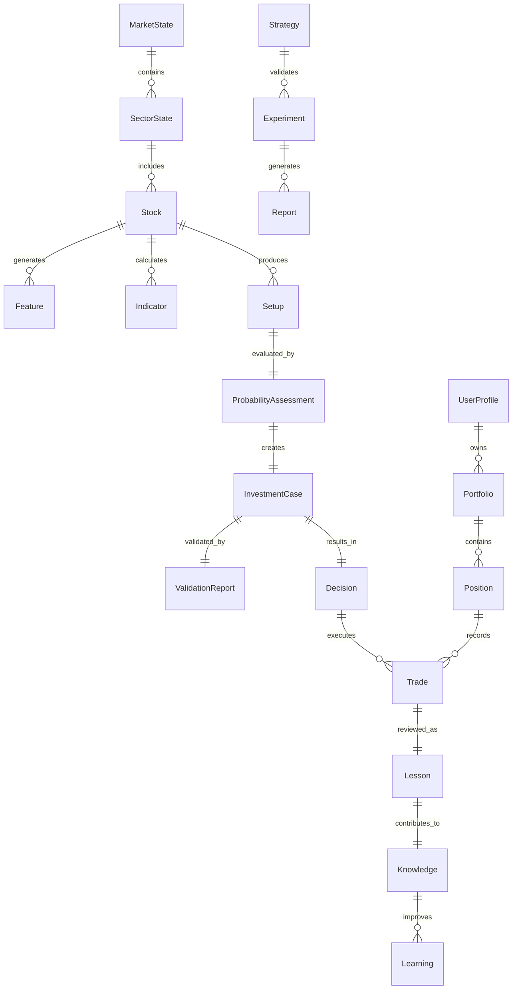

# ATHENA Entity Relationship Model (ERM)

> **Defines the relationships between all business entities in ATHENA**

---

| Property | Value |
|----------|-------|
| Document | ENTITY_RELATIONSHIP.md |
| Document ID | ATH-DATA-002 |
| Version | 1.0.0 |
| Status | Draft |
| Owner | ATHENA Labs |
| Classification | Data Architecture |
| Depends On | DATA_MODEL.md |
| Related Documents | DATA_DICTIONARY.md, FEATURE_STORE.md |

---

# Purpose

The Entity Relationship Model (ERM) describes how the canonical business entities
within ATHENA are connected.

This document is independent of any database technology.

Its purpose is to model the business domain—not SQL tables.

---

# Domain Overview



---

# Aggregate Boundaries

ATHENA follows Domain-Driven Design (DDD).

Each aggregate has exactly one root.

| Aggregate | Root Entity |
|------------|-------------|
| Market | MarketState |
| Sector | SectorState |
| Stock | Stock |
| Setup | Setup |
| Investment | InvestmentCase |
| Portfolio | Portfolio |
| Knowledge | Knowledge |
| Research | Strategy |

---

# Entity Relationships

---

## MarketState

### Owns

- SectorState

Relationship

```
1 MarketState

↓

Many SectorState
```

---

## SectorState

### Owns

Many Stocks

```
Sector

↓

Stocks
```

---

## Stock

Produces

- Indicators
- Features
- Setups

Relationship

```
One Stock

↓

Many Features

↓

Many Indicators

↓

Many Setups
```

---

## Setup

A Setup represents one investment opportunity.

Each Setup receives exactly one

Probability Assessment.

```
Setup

↓

Probability
```

Cardinality

```
1 : 1
```

---

## Probability Assessment

Each Probability Assessment generates one

Investment Case.

```
Probability

↓

Investment Case
```

---

## Investment Case

Each Investment Case produces

- Validation Report
- Decision

Relationship

```
Investment Case

↓

Validation

↓

Decision
```

---

## Decision

One Decision

may generate

zero or many Trades.

Example

Paper Trading

↓

Decision

↓

No Trade

Live Trading

↓

Decision

↓

Trade

Relationship

```
Decision

↓

0..N Trades
```

---

## Portfolio

One Portfolio

contains

many Positions.

```
Portfolio

↓

Positions
```

---

## Position

One Position

contains

many Trades.

```
Position

↓

Trades
```

---

## Trade

Every completed Trade

must produce

one Lesson.

```
Trade

↓

Lesson
```

No completed trade should exist without review.

---

## Lesson

Lessons become

Knowledge.

```
Lesson

↓

Knowledge
```

---

## Knowledge

Knowledge continuously creates

Learning.

```
Knowledge

↓

Learning
```

---

## Strategy

One Strategy

contains

many Experiments.

```
Strategy

↓

Experiments
```

---

## Experiment

Experiments produce Reports.

```
Experiment

↓

Report
```

---

# Cardinality Summary

| Relationship | Cardinality |
|--------------|-------------|
| Market → Sector | 1 : N |
| Sector → Stock | 1 : N |
| Stock → Feature | 1 : N |
| Stock → Indicator | 1 : N |
| Stock → Setup | 1 : N |
| Setup → ProbabilityAssessment | 1 : 1 |
| ProbabilityAssessment → InvestmentCase | 1 : 1 |
| InvestmentCase → ValidationReport | 1 : 1 |
| InvestmentCase → Decision | 1 : 1 |
| Decision → Trade | 1 : 0..N |
| Portfolio → Position | 1 : N |
| Position → Trade | 1 : N |
| Trade → Lesson | 1 : 1 |
| Lesson → Knowledge | 1 : 1 |
| Knowledge → Learning | 1 : N |
| Strategy → Experiment | 1 : N |
| Experiment → Report | 1 : N |
| User → Portfolio | 1 : N |

---

# Lifecycle Flow


---

# Service Ownership

| Entity | Owning Service |
|----------|----------------|
| MarketState | Market Intelligence |
| SectorState | Market Intelligence |
| Stock | Scanner Intelligence |
| Indicator | Feature Engineering |
| Feature | Feature Engineering |
| Setup | Setup Intelligence |
| ProbabilityAssessment | Probabilistic Intelligence |
| InvestmentCase | Investment Decision |
| ValidationReport | Validation Intelligence |
| Decision | Investment Decision |
| Portfolio | Portfolio Intelligence |
| Position | Portfolio Intelligence |
| Trade | Portfolio Intelligence |
| Lesson | Knowledge Intelligence |
| Knowledge | Knowledge Intelligence |
| Learning | Learning Intelligence |
| Strategy | Strategy Lab |
| Experiment | Strategy Lab |
| Report | Reporting |
| UserProfile | Platform Services |

---

# Design Rules

1. Every entity has one owner.
2. Cross-service updates are prohibited.
3. Services communicate through APIs or events.
4. Business entities are independent of database tables.
5. Entity IDs are immutable.
6. Historical versions are preserved.
7. Business relationships must not depend on UI design.

---

# Future Extensions

The ERM supports additional domains without redesign.

Examples:

- Options
- Futures
- ETFs
- Mutual Funds
- Commodities
- Crypto
- International Markets

Only new entities are added.
Existing relationships remain stable.

---

# References

- DATA_MODEL.md
- DATA_DICTIONARY.md
- FEATURE_STORE.md
- KNOWLEDGE_GRAPH.md
- ATHENA_SYSTEM_ARCHITECTURE.md

---

**End of Document**
