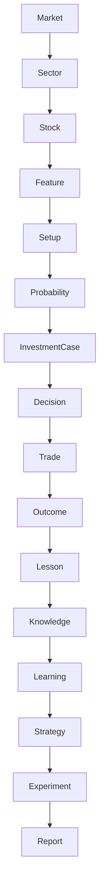

# ATHENA Knowledge Graph

> **Transforming Market Data into Institutional Knowledge**

---

| Property | Value |
|----------|-------|
| Document | KNOWLEDGE_GRAPH.md |
| Document ID | ATH-DATA-005 |
| Version | 1.0.0 |
| Status | Draft |
| Owner | ATHENA Labs |
| Classification | Knowledge Architecture |
| Depends On | DATA_MODEL.md |
| Related Documents | FEATURE_STORE.md, ENTITY_RELATIONSHIP.md |

---

# Purpose

The ATHENA Knowledge Graph connects market data, trading decisions,
outcomes and lessons into a continuously growing institutional memory.

Unlike traditional trading systems that only store transactions,
ATHENA stores relationships.

This enables:

- Explainable AI
- Historical reasoning
- Similarity search
- Continuous learning
- Strategy improvement

---

# Vision

ATHENA should answer questions like:

- Have we seen this setup before?
- What happened last time?
- Which sectors behave similarly?
- Which strategies perform best in bull markets?
- What mistakes are repeated?
- Which trader behaviour reduces performance?

These answers come from the Knowledge Graph.

---

# Knowledge Pipeline

```text
Market

↓

Sector

↓

Stock

↓

Feature

↓

Setup

↓

Probability

↓

Investment Case

↓

Decision

↓

Trade

↓

Outcome

↓

Lesson

↓

Knowledge

↓

Learning
```

---

# Core Principles

1. Every decision creates knowledge.
2. Every trade creates evidence.
3. Every lesson improves future decisions.
4. Relationships are first-class citizens.
5. Nothing valuable is deleted.

---

# Node Types

## Market

Represents an overall market state.

Examples

- Bull
- Bear
- Sideways

Attributes

- Regime
- Breadth
- Volatility
- VIX

---

## Sector

Represents an industry sector.

Examples

- Banking
- IT
- Auto
- Pharma

---

## Stock

Represents an individual security.

Examples

- TCS
- Reliance
- HDFC Bank

---

## Feature

Calculated values.

Examples

- EMA50
- RSI
- ATR
- Volume Spike
- Relative Strength

---

## Setup

Trading opportunity.

Examples

- EMA Pullback
- Breakout
- Mean Reversion
- Dividend Accumulation

---

## Probability

Represents AI assessment.

Contains

- Success Probability
- Confidence
- Historical Similarity
- Expected Return

---

## Investment Case

Represents a complete proposal.

Contains

- Evidence
- Counterarguments
- Committee Notes
- Recommendation

---

## Decision

Represents the approved investment decision.

Examples

- BUY
- WAIT
- HOLD
- EXIT
- NO TRADE

---

## Trade

Represents execution.

Contains

- Entry
- Exit
- Quantity
- Holding Period
- P&L

---

## Outcome

Represents actual result.

Examples

- Target Hit
- Stop Loss
- Partial Exit
- Time Exit

---

## Lesson

Captures learning.

Examples

- Entered too early
- Ignored market trend
- Excellent setup
- Poor risk management

---

## Knowledge

Structured institutional memory.

Knowledge is independent of any individual trade.

---

## Learning

Represents improvements generated by ATHENA.

Examples

- Updated probability model
- Improved confidence calibration
- Better setup ranking

---

# Relationship Types

| Relationship | Meaning |
|--------------|---------|
| OCCURRED_IN | Event happened in Market |
| BELONGS_TO | Stock belongs to Sector |
| HAS_FEATURE | Stock has Feature |
| GENERATED | Setup generated Probability |
| CREATED | Probability created Investment Case |
| APPROVED | Committee approved Decision |
| EXECUTED_AS | Decision executed as Trade |
| RESULTED_IN | Trade produced Outcome |
| LEARNED | Outcome created Lesson |
| CONTRIBUTES_TO | Lesson updates Knowledge |
| IMPROVES | Knowledge improves Learning |
| VALIDATES | Experiment validates Strategy |

---

# Knowledge Graph Model



---

# Decision Lineage

Every investment recommendation can be traced.

```text
Market

↓

Setup

↓

Probability

↓

Decision

↓

Trade

↓

Outcome

↓

Lesson
```

Nothing is disconnected.

---

# Similarity Search

ATHENA supports graph-based reasoning.

Examples

Find:

- Similar setups
- Similar market regimes
- Similar outcomes
- Similar failures
- Similar portfolio states

Instead of matching one variable,
ATHENA compares relationships.

---

# Knowledge Categories

## Market Knowledge

Examples

- Bull market behaviour
- Bear market behaviour
- Volatility regimes

---

## Sector Knowledge

Examples

- Sector rotation
- Relative strength
- Leadership changes

---

## Strategy Knowledge

Examples

- Breakout performance
- Pullback success rate
- Dividend strategy performance

---

## Risk Knowledge

Examples

- Position sizing mistakes
- Drawdown patterns
- Correlation issues

---

## Behaviour Knowledge

Examples

- Fear
- Greed
- Overtrading
- Confirmation bias

---

# Knowledge Lifecycle

```text
Observation

↓

Decision

↓

Execution

↓

Outcome

↓

Review

↓

Lesson

↓

Knowledge

↓

Learning
```

---

# AI Usage

The AI Coach may query the Knowledge Graph to answer:

- Why was this recommendation generated?
- Has this happened before?
- Which strategy performs better?
- What mistakes should be avoided?
- Which market conditions favour this setup?

---

# Graph Queries

Examples

## Find Similar Setups

```
MATCH

Setup

→ Probability

→ Outcome
```

---

## Find Successful Decisions

```
Decision

→ Trade

→ Outcome

WHERE

Outcome = Target Hit
```

---

## Find Repeated Mistakes

```
Lesson

GROUP BY

Lesson Type
```

---

## Find Best Strategy

```
Strategy

↓

Experiment

↓

Report
```

---

# Knowledge Quality Rules

Knowledge must be:

- Traceable
- Explainable
- Versioned
- Immutable
- Auditable
- Evidence-based

---

# Future Enhancements

Future versions may include:

- Graph Database (Neo4j)
- Graph Neural Networks
- Embedding Search
- Semantic Similarity
- Retrieval-Augmented Generation (RAG)
- Knowledge Graph Visualization
- AI Memory Service

---

# References

- DATA_MODEL.md
- ENTITY_RELATIONSHIP.md
- DATA_DICTIONARY.md
- FEATURE_STORE.md
- ATHENA_SYSTEM_ARCHITECTURE.md
- ATHENA_SERVICE_CATALOG.md

---

**End of Document**
