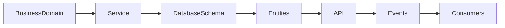

# ATHENA Domain Schema Map

> **The authoritative mapping between business domains, services, database schemas, APIs, events and ownership within ATHENA.**

---

| Property | Value |
|----------|-------|
| Document | DOMAIN_SCHEMA_MAP.md |
| Document ID | ATH-DB-002 |
| Version | 1.0.0 |
| Status | Draft |
| Owner | ATHENA Labs |
| Classification | Database Architecture |
| Depends On | DATABASE_ARCHITECTURE.md |
| Related Documents | ATHENA_SERVICE_CATALOG.md, DATA_MODEL.md |

---

# Purpose

The Domain Schema Map provides end-to-end traceability between business
domains and their technical implementation.

It connects:

- Business Domain
- Service
- Database Schema
- API Resources
- Events
- Core Entities
- Ownership

This document is the primary reference when introducing new features or
modifying existing functionality.

---

# Domain Overview



---

# Domain Mapping Matrix

| Business Domain | Service | Database Schema | Primary API | Primary Events |
|-----------------|----------|----------------|-------------|----------------|
| Market | Market Intelligence | market | /markets | MarketRegimeChanged |
| Sector | Market Intelligence | market | /sectors | SectorRankingUpdated |
| Scanner | Scanner Intelligence | scanner | /scanners | SetupDetected |
| Setup | Setup Intelligence | setup | /setups | SetupValidated |
| Probability | Probability Service | probability | /probabilities | ProbabilityCalculated |
| Investment Committee | Committee Service | decision | /committee | CommitteeRecommendationCreated |
| Decision | Decision Service | decision | /decisions | DecisionApproved |
| Validation | Validation Service | validation | /validations | ValidationPassed |
| Risk | Risk Service | risk | /risk | RiskCalculated |
| Portfolio | Portfolio Service | portfolio | /portfolios | PortfolioUpdated |
| Position | Portfolio Service | portfolio | /positions | PositionUpdated |
| Trade | Portfolio Service | portfolio | /trades | TradeExecuted |
| Knowledge | Knowledge Service | knowledge | /knowledge | KnowledgeUpdated |
| Learning | Learning Service | learning | /learning | ModelImproved |
| Strategy Lab | Strategy Lab | strategy | /strategies | StrategyValidated |
| Reporting | Reporting Service | reporting | /reports | ReportGenerated |
| Authentication | Auth Service | auth | /auth | UserAuthenticated |
| Configuration | Config Service | config | /config | ConfigurationUpdated |
| Audit | Audit Service | audit | /audit | AuditRecorded |

---

# Domain Details

---

## Market Domain

### Business Purpose

Maintain current market conditions.

### Database Schema

market

### Primary Entities

- MarketState
- SectorState
- MarketEvent

### API Resources

```
GET /markets

GET /markets/state

GET /markets/summary
```

### Published Events

- MarketRegimeChanged
- MarketHealthUpdated
- SectorRankingUpdated

### Consumers

- Scanner
- Probability
- Portfolio
- Reporting

---

## Scanner Domain

### Schema

scanner

### Entities

- ScanJob
- ScanResult
- Watchlist

### APIs

```
/scanners

/scanners/results
```

### Events

- SetupDetected
- WatchlistUpdated

---

## Setup Domain

### Schema

setup

### Entities

- Setup
- Pattern
- Candidate

### APIs

```
/setups
```

### Events

- SetupValidated
- SetupExpired

---

## Probability Domain

### Schema

probability

### Entities

- ProbabilityAssessment
- SimilarityMatch
- ConfidenceCalibration

### APIs

```
/probabilities
```

### Events

- ProbabilityCalculated
- ConfidenceUpdated

---

## Decision Domain

### Schema

decision

### Entities

- InvestmentCase
- CommitteeVote
- Decision

### APIs

```
/investment-cases

/decisions
```

### Events

- CommitteeRecommendationCreated
- DecisionApproved
- DecisionRejected

---

## Validation Domain

### Schema

validation

### Entities

- ValidationReport

### APIs

```
/validations
```

### Events

- ValidationPassed
- ValidationFailed

---

## Risk Domain

### Schema

risk

### Entities

- RiskProfile
- RiskLimit
- Exposure

### APIs

```
/risk
```

### Events

- RiskCalculated
- RiskLimitExceeded

---

## Portfolio Domain

### Schema

portfolio

### Entities

- Portfolio
- Position
- Trade

### APIs

```
/portfolios

/positions

/trades
```

### Events

- PortfolioUpdated
- PositionUpdated
- TradeCreated
- TradeExecuted

---

## Knowledge Domain

### Schema

knowledge

### Entities

- Lesson
- Knowledge
- DecisionHistory

### APIs

```
/knowledge

/lessons
```

### Events

- LessonCreated
- KnowledgeUpdated

---

## Learning Domain

### Schema

learning

### Entities

- Learning
- ModelVersion
- Calibration

### APIs

```
/learning
```

### Events

- ModelImproved
- CalibrationUpdated

---

## Strategy Domain

### Schema

strategy

### Entities

- Strategy
- Experiment
- Backtest

### APIs

```
/strategies

/experiments
```

### Events

- ExperimentCompleted
- StrategyValidated

---

## Reporting Domain

### Schema

reporting

### Entities

- Report
- Dashboard
- Analytics

### APIs

```
/reports
```

### Events

- ReportGenerated

---

# Cross-Domain Dependencies

```text
Market
    ↓
Scanner
    ↓
Setup
    ↓
Probability
    ↓
Decision
    ↓
Validation
    ↓
Risk
    ↓
Portfolio
    ↓
Knowledge
    ↓
Learning
    ↓
Strategy
    ↓
Reporting
```

Each downstream domain consumes information from upstream domains without directly modifying their data.

---

# Ownership Rules

Every domain owns:

- Database schema
- Business entities
- APIs
- Domain events
- Business rules

No domain may update another domain's schema directly.

Communication occurs through APIs or events only.

---

# Traceability Matrix

| Business Requirement | Domain | Service | Schema | API | Event |
|----------------------|--------|---------|--------|-----|-------|
| Detect market regime | Market | Market Intelligence | market | /markets | MarketRegimeChanged |
| Generate trade setup | Setup | Setup Service | setup | /setups | SetupValidated |
| Calculate probability | Probability | Probability Service | probability | /probabilities | ProbabilityCalculated |
| Execute trade | Portfolio | Portfolio Service | portfolio | /trades | TradeExecuted |
| Learn from outcome | Knowledge | Knowledge Service | knowledge | /knowledge | LessonCreated |

---

# Domain Governance

Each domain must provide:

- Architecture documentation
- API documentation
- Database ownership
- Event definitions
- Test coverage
- Monitoring
- Operational metrics

---

# Future Expansion

The architecture supports new domains without affecting existing domains.

Examples:

- Options
- Futures
- Commodities
- Crypto
- Mutual Funds
- International Markets
- Enterprise Decision Support

Each new capability is implemented as a new domain with its own service, schema, APIs and events.

---

# References

- DATABASE_ARCHITECTURE.md
- ATHENA_SERVICE_CATALOG.md
- DATA_MODEL.md
- EVENT_CATALOG.md
- API_DESIGN_GUIDELINES.md

---

# Revision History

| Version | Date | Description |
|----------|------|-------------|
| 1.0.0 | July 2026 | Initial Domain Schema Map |

---

**End of Document**
