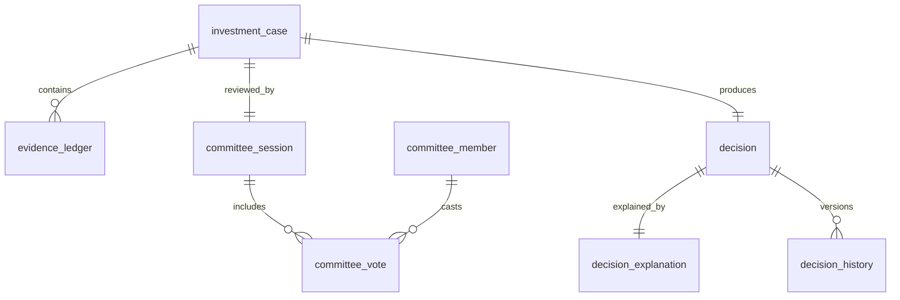

# ATHENA Decision Schema

> **Database schema specification for the Investment Decision Service**

---

| Property | Value |
|----------|-------|
| Schema | decision |
| Document | decision-schema.md |
| Version | 1.0.0 |
| Database | PostgreSQL 17+ |
| Owner | Investment Decision Service |

---

# Purpose

The **decision** schema represents the core reasoning layer of ATHENA.

It transforms:

- Market Evidence
- Setup Quality
- Historical Probability
- Risk Assessment
- Portfolio Context

into a structured and auditable investment decision.

No trade recommendation exists outside this schema.

---

# Responsibilities

The Decision Service is responsible for:

- Creating Investment Cases
- Recording Committee Opinions
- Recording Evidence
- Producing Final Decisions
- Explaining Recommendations
- Publishing Decision Events

---

# Workflow

```
Validated Setup

↓

Probability Assessment

↓

Evidence Ledger

↓

Investment Committee

↓

Investment Case

↓

Decision

↓

Validation

↓

Risk

↓

Portfolio
```

---

# Schema Overview

```
decision

├── investment_case
├── evidence_ledger
├── committee_member
├── committee_vote
├── committee_session
├── decision
├── decision_explanation
├── decision_history
```

---

# Entity Relationship



---

# Table: investment_case

## Purpose

Represents a complete investment proposal.

---

## Columns

| Column | Type |
|----------|------|
| id | UUID |
| setup_id | UUID |
| probability_assessment_id | UUID |
| case_number | VARCHAR(50) |
| recommendation | VARCHAR(30) |
| confidence | NUMERIC(5,2) |
| expected_return | NUMERIC(6,2) |
| expected_drawdown | NUMERIC(6,2) |
| created_at | TIMESTAMP |

---

## Recommendation Values

```
BUY

SELL

WATCH

WAIT

EXIT

REDUCE

NO_TRADE
```

---

# Table: evidence_ledger

## Purpose

Stores every piece of evidence used to support the investment case.

Every recommendation must be explainable.

---

## Columns

| Column | Type |
|----------|------|
| id | UUID |
| investment_case_id | UUID |
| evidence_category | VARCHAR(50) |
| evidence_name | VARCHAR(100) |
| weight | NUMERIC(5,2) |
| score | NUMERIC(5,2) |
| explanation | TEXT |

---

## Example

| Category | Weight | Score |
|----------|-------:|------:|
| Market | 20 | 18 |
| Sector | 15 | 13 |
| Technical | 20 | 19 |
| Probability | 20 | 16 |
| Risk | 15 | 12 |
| Portfolio | 10 | 9 |

---

# Table: committee_member

## Purpose

Defines specialist committee roles.

---

## Columns

| Column | Type |
|----------|------|
| id | UUID |
| member_name | VARCHAR(100) |
| member_role | VARCHAR(100) |
| active | BOOLEAN |

---

## Default Members

- Market Analyst
- Technical Analyst
- Probability Expert
- Risk Manager
- Portfolio Manager
- Behaviour Coach
- Research Analyst

---

# Table: committee_session

## Purpose

Represents one investment committee meeting.

---

## Columns

| Column | Type |
|----------|------|
| id | UUID |
| investment_case_id | UUID |
| session_time | TIMESTAMP |
| final_verdict | VARCHAR(30) |
| consensus_score | NUMERIC(5,2) |

---

# Table: committee_vote

## Purpose

Stores every committee vote.

---

## Columns

| Column | Type |
|----------|------|
| id | UUID |
| committee_session_id | UUID |
| committee_member_id | UUID |
| vote | VARCHAR(30) |
| confidence | NUMERIC(5,2) |
| comments | TEXT |

---

## Vote Values

```
APPROVE

REJECT

WATCH

REVIEW
```

---

# Table: decision

## Purpose

Represents the final decision.

---

## Columns

| Column | Type |
|----------|------|
| id | UUID |
| investment_case_id | UUID |
| decision_type | VARCHAR(30) |
| decision_score | NUMERIC(5,2) |
| approved | BOOLEAN |
| approved_at | TIMESTAMP |

---

# Table: decision_explanation

## Purpose

Human-readable explanation.

---

## Columns

| Column | Type |
|----------|------|
| id | UUID |
| decision_id | UUID |
| summary | TEXT |
| strengths | JSONB |
| weaknesses | JSONB |
| counter_arguments | JSONB |
| recommendation_reason | TEXT |

---

# Table: decision_history

## Purpose

Tracks every change.

---

## Columns

| Column | Type |
|----------|------|
| id | UUID |
| decision_id | UUID |
| previous_status | VARCHAR(30) |
| current_status | VARCHAR(30) |
| changed_at | TIMESTAMP |
| changed_by | UUID |
| reason | TEXT |

---

# Decision Lifecycle

```
Investment Case

↓

Evidence Review

↓

Committee Review

↓

Voting

↓

Decision

↓

Validation

↓

Risk

↓

Portfolio
```

---

# Events Produced

- InvestmentCaseCreated
- EvidenceRecorded
- CommitteeSessionStarted
- CommitteeVoteSubmitted
- DecisionApproved
- DecisionRejected
- DecisionUpdated

---

# Materialized Views

```
mv_decision_summary

mv_committee_statistics

mv_decision_accuracy

mv_recommendation_distribution
```

---

# Partition Strategy

Monthly partition

Tables

```
decision_history

committee_vote
```

---

# Estimated Growth

| Table | Growth |
|--------|---------|
| investment_case | High |
| evidence_ledger | Very High |
| committee_session | High |
| committee_vote | Very High |
| decision | High |
| decision_history | Very High |

---

# Security

Write Access

- Investment Decision Service

Read Access

- Validation Service
- Risk Service
- Portfolio Service
- Knowledge Service
- AI Coach
- Reporting

---

# Sample Query

```sql
SELECT
    ic.case_number,
    d.decision_type,
    d.decision_score,
    cs.consensus_score
FROM decision.investment_case ic
JOIN decision.decision d
ON ic.id = d.investment_case_id
JOIN decision.committee_session cs
ON ic.id = cs.investment_case_id
WHERE d.approved = TRUE
ORDER BY d.decision_score DESC;
```

---

# References

- probability-schema.md
- validation-schema.md
- EVENT_CATALOG.md
- KNOWLEDGE_GRAPH.md
- DOMAIN_SCHEMA_MAP.md

---

# Revision History

| Version | Date | Description |
|----------|------|-------------|
| 1.0.0 | July 2026 | Initial Decision Schema |

---

**End of Document**
