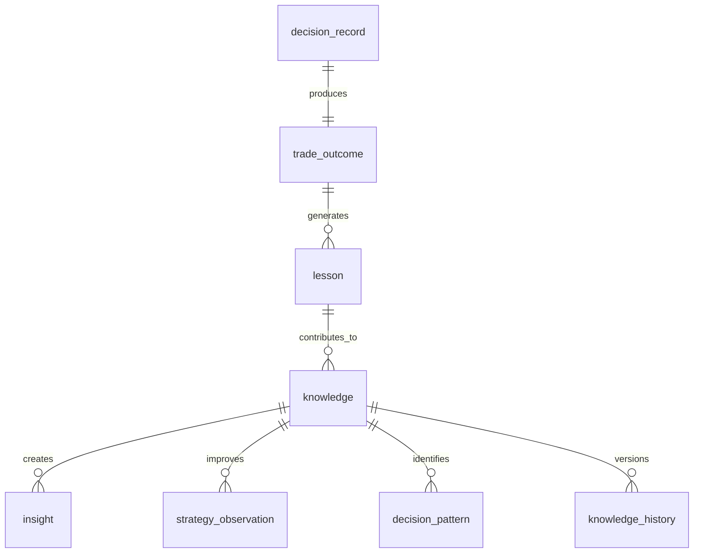

# ATHENA Knowledge Schema

> **Database schema specification for the Knowledge Intelligence Service**

---

| Property | Value |
|----------|-------|
| Schema | knowledge |
| Document | knowledge-schema.md |
| Version | 1.0.0 |
| Database | PostgreSQL 17+ |
| Owner | Knowledge Intelligence Service |

---

# Purpose

The **knowledge** schema stores ATHENA's institutional memory.

Unlike traditional trading systems that only store trades,
ATHENA stores:

- Decisions
- Outcomes
- Lessons
- Knowledge
- Insights
- Strategy Improvements

The Knowledge Service enables ATHENA to continuously improve.

---

# Responsibilities

The Knowledge Intelligence Service is responsible for:

- Recording completed decisions
- Recording trade outcomes
- Generating lessons
- Building institutional knowledge
- Supporting similarity search
- Supporting AI reasoning

---

# Workflow

```
Decision

↓

Trade

↓

Outcome

↓

Review

↓

Lesson

↓

Knowledge

↓

Learning Service
```

---

# Schema Overview

```
knowledge

├── decision_record
├── trade_outcome
├── lesson
├── knowledge
├── insight
├── strategy_observation
├── decision_pattern
├── knowledge_history
```

---

# Entity Relationship



---

# Table: decision_record

## Purpose

Stores completed investment decisions.

---

## Columns

| Column | Type |
|----------|------|
| id | UUID |
| investment_case_id | UUID |
| decision_id | UUID |
| recommendation | VARCHAR(30) |
| approved_at | TIMESTAMP |
| executed | BOOLEAN |
| created_at | TIMESTAMP |

---

# Table: trade_outcome

## Purpose

Captures the actual outcome of an executed trade.

---

## Columns

| Column | Type |
|----------|------|
| id | UUID |
| trade_id | UUID |
| outcome_type | VARCHAR(30) |
| pnl_amount | NUMERIC(18,2) |
| pnl_percentage | NUMERIC(8,2) |
| holding_days | INTEGER |
| target_hit | BOOLEAN |
| stop_hit | BOOLEAN |
| closed_at | TIMESTAMP |

---

## Outcome Types

- TARGET_HIT
- STOP_LOSS
- TIME_EXIT
- MANUAL_EXIT
- PARTIAL_EXIT

---

# Table: lesson

## Purpose

Stores lessons generated after trade review.

---

## Columns

| Column | Type |
|----------|------|
| id | UUID |
| trade_outcome_id | UUID |
| lesson_type | VARCHAR(50) |
| summary | TEXT |
| recommendation | TEXT |
| confidence | NUMERIC(5,2) |
| created_at | TIMESTAMP |

---

## Lesson Types

- Success
- Mistake
- Risk
- Behaviour
- Strategy
- Market

---

# Table: knowledge

## Purpose

Stores validated institutional knowledge.

---

## Columns

| Column | Type |
|----------|------|
| id | UUID |
| lesson_id | UUID |
| knowledge_category | VARCHAR(50) |
| title | VARCHAR(200) |
| description | TEXT |
| confidence_score | NUMERIC(5,2) |
| evidence_count | INTEGER |
| active | BOOLEAN |

---

# Table: insight

## Purpose

Stores AI-generated insights.

---

## Columns

| Column | Type |
|----------|------|
| id | UUID |
| knowledge_id | UUID |
| insight_type | VARCHAR(50) |
| insight_text | TEXT |
| generated_at | TIMESTAMP |

---

## Insight Types

- Pattern
- Opportunity
- Warning
- Optimization
- Observation

---

# Table: strategy_observation

## Purpose

Stores observations about strategy performance.

---

## Columns

| Column | Type |
|----------|------|
| id | UUID |
| strategy_id | UUID |
| knowledge_id | UUID |
| observation | TEXT |
| recommendation | TEXT |
| impact_score | NUMERIC(5,2) |

---

# Table: decision_pattern

## Purpose

Identifies recurring decision patterns.

---

## Columns

| Column | Type |
|----------|------|
| id | UUID |
| pattern_name | VARCHAR(100) |
| frequency | INTEGER |
| success_rate | NUMERIC(5,2) |
| confidence_score | NUMERIC(5,2) |
| description | TEXT |

---

## Example Patterns

- High Volume Breakout
- Bull Market Pullback
- Early Exit
- Overtrading
- Sector Rotation

---

# Table: knowledge_history

## Purpose

Maintains version history of knowledge entries.

---

## Columns

| Column | Type |
|----------|------|
| id | UUID |
| knowledge_id | UUID |
| previous_version | INTEGER |
| current_version | INTEGER |
| changed_at | TIMESTAMP |
| reason | TEXT |

---

# Knowledge Lifecycle

```
Trade

↓

Outcome

↓

Lesson

↓

Knowledge

↓

Insight

↓

Learning
```

---

# Events Produced

- TradeOutcomeRecorded
- LessonCreated
- KnowledgeCreated
- KnowledgeUpdated
- InsightGenerated
- DecisionPatternIdentified

---

# Materialized Views

```
mv_lessons

mv_top_patterns

mv_strategy_observations

mv_knowledge_summary

mv_decision_accuracy
```

---

# Partition Strategy

Partition monthly

Tables

```
trade_outcome

knowledge_history
```

---

# Estimated Growth

| Table | Growth |
|--------|---------|
| decision_record | High |
| trade_outcome | High |
| lesson | High |
| knowledge | Medium |
| insight | Medium |
| strategy_observation | Medium |
| decision_pattern | Low |
| knowledge_history | Medium |

---

# Security

Write Access

- Knowledge Intelligence Service

Read Access

- Learning Service
- AI Coach
- Reporting
- Decision Service

---

# Sample Query

```sql
SELECT
    k.title,
    k.confidence_score,
    dp.pattern_name,
    dp.success_rate
FROM knowledge.knowledge k
JOIN knowledge.decision_pattern dp
ON k.id = dp.id
WHERE k.active = TRUE
ORDER BY k.confidence_score DESC;
```

---

# References

- portfolio-schema.md
- learning-schema.md
- KNOWLEDGE_GRAPH.md
- EVENT_CATALOG.md
- DATABASE_ARCHITECTURE.md

---

# Revision History

| Version | Date | Description |
|----------|------|-------------|
| 1.0.0 | July 2026 | Initial Knowledge Schema |

---

**End of Document**
