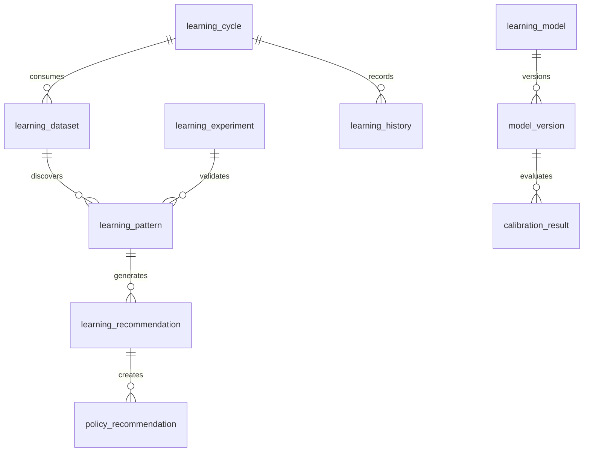

# ATHENA Learning Schema

> **Database schema specification for the Learning Intelligence Service**

---

| Property | Value |
|----------|-------|
| Schema | learning |
| Document | learning-schema.md |
| Version | 1.0.0 |
| Database | PostgreSQL 17+ |
| Owner | Learning Intelligence Service |

---

# Purpose

The **learning** schema is responsible for transforming validated
knowledge into measurable improvements across ATHENA.

Unlike the Knowledge Service, which stores institutional memory,
the Learning Service continuously improves the platform.

Learning never modifies history.

Learning creates new versions.

---

# Responsibilities

The Learning Intelligence Service is responsible for

- Learning from completed trades
- Improving probability calibration
- Updating strategy recommendations
- Detecting behavioural patterns
- Suggesting policy improvements
- Tracking model evolution
- Managing learning experiments

---

# Learning Pipeline

```
Knowledge

↓

Evidence Aggregation

↓

Pattern Discovery

↓

Learning Model

↓

Policy Recommendation

↓

Model Version

↓

Probability Improvement

↓

Decision Improvement
```

---

# Schema Overview

```
learning

├── learning_cycle
├── learning_model
├── learning_dataset
├── learning_pattern
├── learning_recommendation
├── policy_recommendation
├── model_version
├── calibration_result
├── learning_experiment
├── learning_history
```

---

# Entity Relationship



---

# Table: learning_cycle

## Purpose

Represents one complete learning iteration.

Examples

- Daily Learning
- Weekly Learning
- Monthly Strategy Review

---

## Columns

| Column | Type |
|---------|------|
| id | UUID |
| cycle_name | VARCHAR(100) |
| cycle_type | VARCHAR(50) |
| start_time | TIMESTAMP |
| end_time | TIMESTAMP |
| status | VARCHAR(30) |

---

## Cycle Types

- Daily
- Weekly
- Monthly
- Quarterly
- Manual

---

# Table: learning_dataset

## Purpose

Tracks datasets used for learning.

---

## Columns

| Column | Type |
|---------|------|
| id | UUID |
| learning_cycle_id | UUID |
| dataset_name | VARCHAR(100) |
| source | VARCHAR(100) |
| records_used | INTEGER |
| dataset_hash | VARCHAR(128) |
| created_at | TIMESTAMP |

---

# Table: learning_pattern

## Purpose

Stores discovered behavioural and market patterns.

---

## Columns

| Column | Type |
|---------|------|
| id | UUID |
| learning_cycle_id | UUID |
| pattern_name | VARCHAR(150) |
| category | VARCHAR(50) |
| confidence | NUMERIC(5,2) |
| evidence_count | INTEGER |
| description | TEXT |

---

## Categories

- Market
- Strategy
- Behaviour
- Risk
- Portfolio
- Probability

---

# Table: learning_recommendation

## Purpose

Stores recommendations generated by the Learning Engine.

---

## Columns

| Column | Type |
|---------|------|
| id | UUID |
| learning_pattern_id | UUID |
| recommendation_type | VARCHAR(50) |
| priority | VARCHAR(20) |
| recommendation | TEXT |
| expected_impact | NUMERIC(5,2) |

---

## Recommendation Types

- Improve Strategy
- Improve Probability
- Improve Risk
- Improve Portfolio
- Improve Behaviour

---

# Table: policy_recommendation

## Purpose

Suggests updates to system policies.

---

## Columns

| Column | Type |
|---------|------|
| id | UUID |
| recommendation_id | UUID |
| policy_name | VARCHAR(100) |
| current_value | VARCHAR(100) |
| suggested_value | VARCHAR(100) |
| justification | TEXT |
| approval_status | VARCHAR(30) |

---

# Table: learning_model

## Purpose

Represents a logical learning model.

---

## Columns

| Column | Type |
|---------|------|
| id | UUID |
| model_name | VARCHAR(100) |
| model_type | VARCHAR(50) |
| owner_service | VARCHAR(100) |
| active | BOOLEAN |

---

# Table: model_version

## Purpose

Tracks every version of every learning model.

---

## Columns

| Column | Type |
|---------|------|
| id | UUID |
| learning_model_id | UUID |
| version | INTEGER |
| training_date | TIMESTAMP |
| deployed | BOOLEAN |
| performance_score | NUMERIC(6,2) |

---

# Table: calibration_result

## Purpose

Stores calibration performance.

---

## Columns

| Column | Type |
|---------|------|
| id | UUID |
| model_version_id | UUID |
| expected_accuracy | NUMERIC(5,2) |
| actual_accuracy | NUMERIC(5,2) |
| calibration_error | NUMERIC(6,4) |

---

# Table: learning_experiment

## Purpose

Tracks experiments before production deployment.

---

## Columns

| Column | Type |
|---------|------|
| id | UUID |
| experiment_name | VARCHAR(150) |
| hypothesis | TEXT |
| start_date | TIMESTAMP |
| end_date | TIMESTAMP |
| result | VARCHAR(30) |
| approved | BOOLEAN |

---

## Result

- Success
- Failure
- Inconclusive

---

# Table: learning_history

## Purpose

Maintains every learning update.

---

## Columns

| Column | Type |
|---------|------|
| id | UUID |
| learning_cycle_id | UUID |
| previous_version | INTEGER |
| current_version | INTEGER |
| summary | TEXT |
| completed_at | TIMESTAMP |

---

# Events Produced

- LearningCycleStarted
- PatternDiscovered
- RecommendationGenerated
- PolicyRecommendationCreated
- ModelVersionCreated
- CalibrationCompleted
- LearningCompleted

---

# Materialized Views

```
mv_learning_summary

mv_strategy_improvements

mv_model_performance

mv_policy_recommendations

mv_learning_history
```

---

# Partition Strategy

Partition monthly

Tables

```
learning_history

learning_pattern

learning_recommendation
```

---

# Estimated Growth

| Table | Growth |
|--------|---------|
| learning_cycle | Medium |
| learning_dataset | High |
| learning_pattern | High |
| learning_recommendation | High |
| policy_recommendation | Medium |
| model_version | Medium |
| calibration_result | High |
| learning_experiment | Medium |
| learning_history | High |

---

# Security

Write Access

- Learning Intelligence Service

Read Access

- Probability Service
- Decision Service
- AI Coach
- Reporting

No other service may modify learning artifacts.

---

# Sample Query

```sql
SELECT
    lp.pattern_name,
    lr.recommendation,
    pr.policy_name,
    pr.suggested_value
FROM learning.learning_pattern lp
JOIN learning.learning_recommendation lr
ON lp.id = lr.learning_pattern_id
JOIN learning.policy_recommendation pr
ON lr.id = pr.recommendation_id
WHERE lp.confidence >= 80
ORDER BY lp.confidence DESC;
```

---

# References

- knowledge-schema.md
- probability-schema.md
- strategy-schema.md
- EVENT_CATALOG.md
- DATABASE_ARCHITECTURE.md

---

# Revision History

| Version | Date | Description |
|----------|------|-------------|
| 1.0.0 | July 2026 | Initial Learning Schema |

---

**End of Document**
