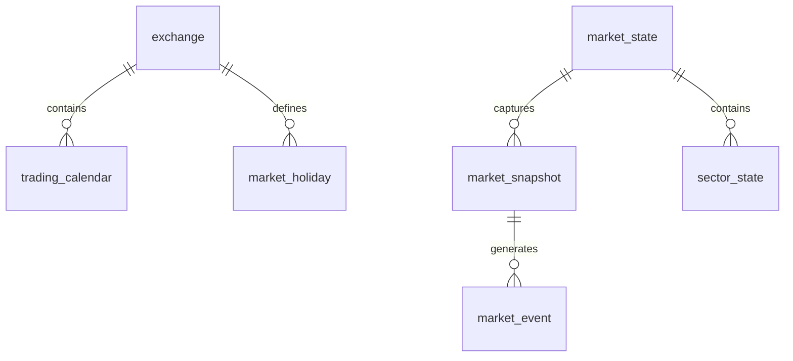

# ATHENA Market Schema

> **Database schema specification for the Market Intelligence domain**

---

| Property | Value |
|----------|-------|
| Schema | market |
| Document | market-schema.md |
| Version | 1.0.0 |
| Database | PostgreSQL 17+ |
| Owner | Market Intelligence Service |

---

# Purpose

The **market** schema stores all market-wide information required by ATHENA.

It contains:

- Market state
- Sector state
- Trading calendar
- Market snapshots
- Market events

This schema is read-heavy and optimized for analytics while preserving historical market conditions.

---

# Schema Overview

```text
market

├── market_state
├── market_snapshot
├── sector_state
├── market_event
├── trading_calendar
├── market_holiday
├── exchange
```

---

# Entity Relationship



---

# Table: exchange

## Purpose

Stores supported exchanges.

## Columns

| Column | Type | Nullable | Description |
|----------|--------|----------|-------------|
| id | UUID | No | Primary Key |
| code | VARCHAR(20) | No | NSE, BSE |
| name | VARCHAR(100) | No | Exchange Name |
| timezone | VARCHAR(50) | No | Timezone |
| currency | VARCHAR(10) | No | Trading Currency |
| created_at | TIMESTAMP | No | Created |
| updated_at | TIMESTAMP | No | Updated |

## Constraints

```
PRIMARY KEY(id)

UNIQUE(code)
```

---

# Table: trading_calendar

Purpose

Trading sessions.

## Columns

| Column | Type |
|----------|------|
| id | UUID |
| exchange_id | UUID |
| trading_date | DATE |
| session | VARCHAR(20) |
| is_trading_day | BOOLEAN |
| open_time | TIME |
| close_time | TIME |

Indexes

```
idx_calendar_date

idx_calendar_exchange
```

---

# Table: market_state

Purpose

Current market condition.

## Columns

| Column | Type |
|----------|------|
| id | UUID |
| trading_date | DATE |
| market_regime | VARCHAR(20) |
| market_health_score | NUMERIC(5,2) |
| market_breadth | NUMERIC(8,2) |
| volatility_score | NUMERIC(8,2) |
| fii_net_flow | NUMERIC(18,2) |
| dii_net_flow | NUMERIC(18,2) |
| vix | NUMERIC(8,2) |
| sentiment | VARCHAR(20) |
| created_at | TIMESTAMP |

Indexes

```
idx_market_date

idx_market_regime
```

---

# Table: sector_state

Purpose

Daily sector performance.

## Columns

| Column | Type |
|----------|------|
| id | UUID |
| market_state_id | UUID |
| sector_name | VARCHAR(100) |
| rank | INTEGER |
| relative_strength | NUMERIC(8,2) |
| momentum | NUMERIC(8,2) |
| trend | VARCHAR(20) |
| volume_score | NUMERIC(8,2) |
| updated_at | TIMESTAMP |

Foreign Key

```
market_state_id

↓

market_state.id
```

Indexes

```
idx_sector_rank

idx_sector_name
```

---

# Table: market_snapshot

Purpose

Historical market snapshots captured during trading sessions.

Frequency

- Pre-market
- Every 5 minutes
- Market Close

## Columns

| Column | Type |
|----------|------|
| id | UUID |
| market_state_id | UUID |
| captured_at | TIMESTAMP |
| nifty50 | NUMERIC(12,2) |
| sensex | NUMERIC(12,2) |
| bank_nifty | NUMERIC(12,2) |
| india_vix | NUMERIC(8,2) |
| advance_decline_ratio | NUMERIC(8,2) |
| total_volume | NUMERIC(20,2) |
| market_cap | NUMERIC(20,2) |

Partition

Monthly

Indexes

```
idx_snapshot_time

idx_snapshot_market
```

---

# Table: market_event

Purpose

Important market events.

Examples

- RBI Policy
- Budget
- CPI
- Fed Meeting
- Circuit Breaker
- Earnings Season

## Columns

| Column | Type |
|----------|------|
| id | UUID |
| market_snapshot_id | UUID |
| event_type | VARCHAR(100) |
| title | VARCHAR(200) |
| description | TEXT |
| severity | VARCHAR(20) |
| event_time | TIMESTAMP |
| source | VARCHAR(200) |

Indexes

```
idx_event_type

idx_event_time

idx_event_severity
```

---

# Table: market_holiday

Purpose

Market holidays.

## Columns

| Column | Type |
|----------|------|
| id | UUID |
| exchange_id | UUID |
| holiday_date | DATE |
| holiday_name | VARCHAR(200) |

Unique

```
exchange_id

holiday_date
```

---

# Relationships

```
exchange

↓

trading_calendar

↓

market_state

↓

sector_state

↓

market_snapshot

↓

market_event
```

---

# Events Produced

The Market schema supports:

- MarketRegimeChanged
- MarketHealthUpdated
- SectorRankingUpdated
- MarketSnapshotCaptured

---

# Read Models

Materialized Views

```
mv_market_summary

mv_sector_strength

mv_market_breadth

mv_market_sentiment
```

---

# Partition Strategy

Partition monthly

Tables

```
market_snapshot

market_event
```

---

# Estimated Growth

| Table | Growth |
|--------|---------|
| market_state | Daily |
| sector_state | Daily × sectors |
| market_snapshot | Every 5 min |
| market_event | Event driven |

---

# Security

Read Access

- Scanner Service
- Probability Service
- Decision Service
- Reporting

Write Access

- Market Intelligence Service only

---

# Sample Query

```sql
SELECT
    sector_name,
    rank,
    relative_strength
FROM market.sector_state
WHERE trend = 'Bull'
ORDER BY rank ASC;
```

---

# References

- DATABASE_ARCHITECTURE.md
- DATA_MODEL.md
- DOMAIN_SCHEMA_MAP.md
- market-service OpenAPI specification

---

# Revision History

| Version | Date | Description |
|----------|------|-------------|
| 1.0.0 | July 2026 | Initial Market Schema |

---

**End of Document**
