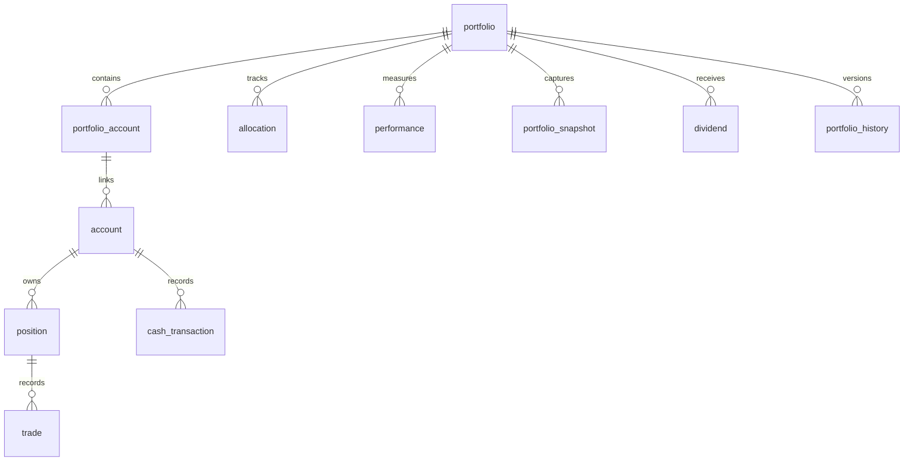

# ATHENA Portfolio Schema

> **Database schema specification for the Portfolio Intelligence Service**

---

| Property | Value |
|----------|-------|
| Schema | portfolio |
| Document | portfolio-schema.md |
| Version | 1.0.0 |
| Database | PostgreSQL 17+ |
| Owner | Portfolio Intelligence Service |

---

# Purpose

The **portfolio** schema manages all investment holdings,
cash balances, positions, trade execution records and portfolio performance.

It is the operational layer of ATHENA.

Unlike the Decision Service, which recommends investments,
the Portfolio Service records what the investor actually owns.

---

# Responsibilities

The Portfolio Intelligence Service is responsible for:

- Portfolio management
- Account management
- Position tracking
- Trade recording
- Cash management
- Portfolio performance
- Asset allocation
- Dividend tracking

---

# Workflow

```
Validated Decision

↓

Risk Approved

↓

Portfolio Allocation

↓

Trade Execution

↓

Position Update

↓

Performance Tracking

↓

Knowledge Service
```

---

# Schema Overview

```
portfolio

├── portfolio
├── account
├── portfolio_account
├── position
├── trade
├── cash_transaction
├── portfolio_snapshot
├── allocation
├── dividend
├── performance
├── portfolio_history
```

---

# Entity Relationship



---

# Table: portfolio

## Purpose

Represents an investment portfolio.

Examples

- Swing Portfolio
- Dividend Portfolio
- Positional Portfolio
- Paper Trading Portfolio

---

## Columns

| Column | Type |
|----------|------|
| id | UUID |
| portfolio_name | VARCHAR(100) |
| portfolio_type | VARCHAR(50) |
| base_currency | VARCHAR(10) |
| initial_capital | NUMERIC(18,2) |
| current_value | NUMERIC(18,2) |
| active | BOOLEAN |
| created_at | TIMESTAMP |

---

# Table: account

## Purpose

Represents a brokerage or virtual account.

---

## Columns

| Column | Type |
|----------|------|
| id | UUID |
| broker_name | VARCHAR(100) |
| account_number | VARCHAR(100) |
| account_type | VARCHAR(50) |
| status | VARCHAR(20) |
| cash_balance | NUMERIC(18,2) |
| created_at | TIMESTAMP |

---

# Table: portfolio_account

## Purpose

Maps portfolios to accounts.

Supports one portfolio using multiple accounts.

---

## Columns

| Column | Type |
|----------|------|
| portfolio_id | UUID |
| account_id | UUID |
| allocation_pct | NUMERIC(5,2) |

---

# Table: position

## Purpose

Represents current holdings.

---

## Columns

| Column | Type |
|----------|------|
| id | UUID |
| account_id | UUID |
| symbol | VARCHAR(20) |
| exchange | VARCHAR(20) |
| quantity | NUMERIC(18,4) |
| average_price | NUMERIC(18,2) |
| market_price | NUMERIC(18,2) |
| unrealized_pl | NUMERIC(18,2) |
| realized_pl | NUMERIC(18,2) |
| opened_at | TIMESTAMP |

---

# Table: trade

## Purpose

Stores every executed trade.

---

## Columns

| Column | Type |
|----------|------|
| id | UUID |
| position_id | UUID |
| investment_case_id | UUID |
| trade_type | VARCHAR(20) |
| execution_price | NUMERIC(18,2) |
| quantity | NUMERIC(18,4) |
| brokerage | NUMERIC(12,2) |
| taxes | NUMERIC(12,2) |
| executed_at | TIMESTAMP |

---

## Trade Types

- BUY
- SELL
- BONUS
- SPLIT
- ADJUSTMENT

---

# Table: cash_transaction

## Purpose

Tracks all cash movements.

---

## Columns

| Column | Type |
|----------|------|
| id | UUID |
| account_id | UUID |
| transaction_type | VARCHAR(30) |
| amount | NUMERIC(18,2) |
| description | TEXT |
| transaction_date | TIMESTAMP |

---

## Transaction Types

- Deposit
- Withdrawal
- Brokerage
- Dividend
- Interest
- Charges

---

# Table: allocation

## Purpose

Tracks allocation across categories.

---

## Columns

| Column | Type |
|----------|------|
| id | UUID |
| portfolio_id | UUID |
| allocation_type | VARCHAR(50) |
| allocation_pct | NUMERIC(5,2) |

---

## Allocation Types

- Sector
- Strategy
- Market Cap
- Asset Class

---

# Table: dividend

## Purpose

Stores dividend receipts.

---

## Columns

| Column | Type |
|----------|------|
| id | UUID |
| portfolio_id | UUID |
| symbol | VARCHAR(20) |
| ex_date | DATE |
| payment_date | DATE |
| dividend_per_share | NUMERIC(12,4) |
| shares | NUMERIC(18,4) |
| total_amount | NUMERIC(18,2) |

---

# Table: performance

## Purpose

Stores portfolio performance metrics.

---

## Columns

| Column | Type |
|----------|------|
| id | UUID |
| portfolio_id | UUID |
| total_return_pct | NUMERIC(6,2) |
| annualized_return | NUMERIC(6,2) |
| sharpe_ratio | NUMERIC(6,2) |
| max_drawdown | NUMERIC(6,2) |
| win_rate | NUMERIC(6,2) |
| calculated_at | TIMESTAMP |

---

# Table: portfolio_snapshot

## Purpose

Captures daily portfolio values.

---

## Columns

| Column | Type |
|----------|------|
| id | UUID |
| portfolio_id | UUID |
| snapshot_date | DATE |
| market_value | NUMERIC(18,2) |
| cash_balance | NUMERIC(18,2) |
| invested_amount | NUMERIC(18,2) |
| unrealized_pl | NUMERIC(18,2) |

---

# Table: portfolio_history

## Purpose

Maintains historical changes.

---

## Columns

| Column | Type |
|----------|------|
| id | UUID |
| portfolio_id | UUID |
| previous_status | VARCHAR(30) |
| current_status | VARCHAR(30) |
| changed_at | TIMESTAMP |
| changed_by | UUID |
| reason | TEXT |

---

# Events Produced

- PortfolioCreated
- TradeExecuted
- PositionUpdated
- CashBalanceUpdated
- PortfolioRebalanced
- DividendReceived
- PortfolioSnapshotCaptured

---

# Materialized Views

```
mv_portfolio_summary

mv_daily_performance

mv_asset_allocation

mv_dividend_income

mv_open_positions
```

---

# Partition Strategy

Partition monthly

Tables

```
trade

cash_transaction

portfolio_snapshot
```

---

# Estimated Growth

| Table | Growth |
|--------|---------|
| portfolio | Low |
| account | Low |
| position | High |
| trade | Very High |
| cash_transaction | High |
| dividend | Medium |
| performance | Daily |
| portfolio_snapshot | Daily |
| portfolio_history | High |

---

# Security

Write Access

- Portfolio Intelligence Service

Read Access

- Knowledge Service
- Reporting Service
- AI Coach
- Risk Service

---

# Sample Query

```sql
SELECT
    p.portfolio_name,
    pos.symbol,
    pos.quantity,
    pos.market_price,
    perf.total_return_pct
FROM portfolio.portfolio p
JOIN portfolio.position pos
ON p.id = pos.account_id
JOIN portfolio.performance perf
ON p.id = perf.portfolio_id
WHERE p.active = TRUE;
```

---

# References

- risk-schema.md
- knowledge-schema.md
- DATABASE_ARCHITECTURE.md
- DOMAIN_SCHEMA_MAP.md
- EVENT_CATALOG.md

---

# Revision History

| Version | Date | Description |
|----------|------|-------------|
| 1.0.0 | July 2026 | Initial Portfolio Schema |

---

**End of Document**
