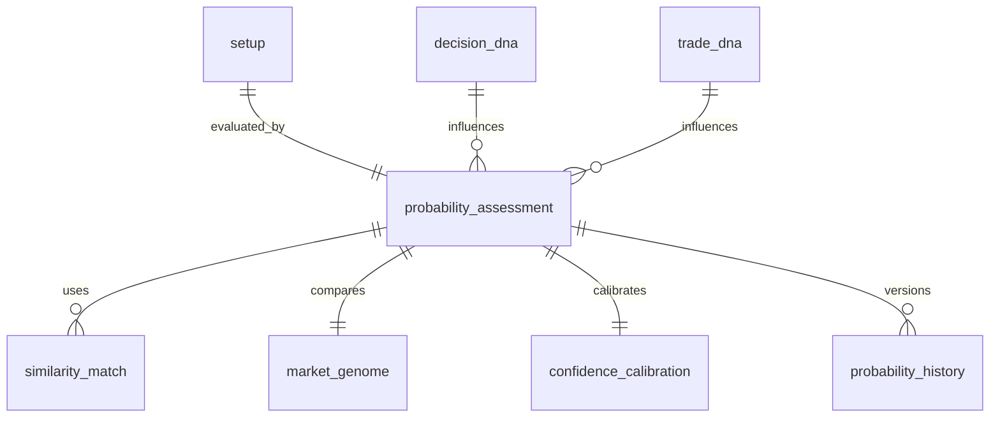

# ATHENA Probability Schema

> **Database schema specification for the Probabilistic Intelligence Service**

---

| Property | Value |
|----------|-------|
| Schema | probability |
| Document | probability-schema.md |
| Version | 1.0.0 |
| Database | PostgreSQL 17+ |
| Owner | Probabilistic Intelligence Service |

---

# Purpose

The **probability** schema stores every probability assessment,
historical similarity, confidence score and learning artifact produced
by ATHENA.

This schema represents ATHENA's evidence engine.

It does **not** predict the future.

It estimates probability based on historical evidence.

---

# Responsibilities

The Probability Intelligence Service is responsible for:

- Historical similarity search
- Market Genome comparison
- Decision DNA
- Trade DNA
- Bayesian updates
- Confidence calibration
- Probability scoring

---

# Workflow

```
Validated Setup

↓

Historical Search

↓

Market Genome Match

↓

Decision DNA

↓

Trade DNA

↓

Probability Assessment

↓

Confidence Calibration

↓

Investment Case
```

---

# Schema Overview

```
probability

├── probability_assessment
├── market_genome
├── similarity_match
├── confidence_calibration
├── decision_dna
├── trade_dna
├── probability_history
├── probability_model
```

---

# Entity Relationship



---

# Table: probability_assessment

## Purpose

Stores the probability generated for a validated setup.

---

## Columns

| Column | Type |
|----------|------|
| id | UUID |
| setup_id | UUID |
| probability_score | NUMERIC(5,2) |
| confidence_score | NUMERIC(5,2) |
| expected_return | NUMERIC(6,2) |
| expected_drawdown | NUMERIC(6,2) |
| expected_holding_days | INTEGER |
| created_at | TIMESTAMP |

---

## Example

```
Setup

EMA Pullback

Probability

74%

Confidence

82%

Expected Return

5.6%

Expected Drawdown

2.1%
```

---

# Table: market_genome

## Purpose

Stores a fingerprint of the market at the time
the probability was calculated.

---

## Columns

| Column | Type |
|----------|------|
| id | UUID |
| probability_assessment_id | UUID |
| market_regime | VARCHAR(30) |
| market_health | NUMERIC(5,2) |
| sector_strength | NUMERIC(5,2) |
| breadth | NUMERIC(6,2) |
| vix | NUMERIC(6,2) |
| fii_flow | NUMERIC(18,2) |
| dii_flow | NUMERIC(18,2) |
| feature_hash | VARCHAR(128) |

---

# Table: similarity_match

## Purpose

Stores historical setups similar to the current one.

---

## Columns

| Column | Type |
|----------|------|
| id | UUID |
| probability_assessment_id | UUID |
| historical_setup_id | UUID |
| similarity_score | NUMERIC(5,2) |
| historical_outcome | VARCHAR(50) |
| return_percentage | NUMERIC(6,2) |

---

# Table: confidence_calibration

## Purpose

Measures how well predicted probabilities match actual outcomes.

---

## Columns

| Column | Type |
|----------|------|
| id | UUID |
| probability_assessment_id | UUID |
| predicted_probability | NUMERIC(5,2) |
| observed_probability | NUMERIC(5,2) |
| calibration_error | NUMERIC(6,4) |
| calibration_version | INTEGER |

---

# Table: decision_dna

## Purpose

Captures characteristics of successful decisions.

---

## Columns

| Column | Type |
|----------|------|
| id | UUID |
| probability_assessment_id | UUID |
| evidence_score | NUMERIC(5,2) |
| committee_alignment | NUMERIC(5,2) |
| market_alignment | NUMERIC(5,2) |
| behaviour_score | NUMERIC(5,2) |
| decision_signature | JSONB |

---

# Table: trade_dna

## Purpose

Captures characteristics of successful trades.

---

## Columns

| Column | Type |
|----------|------|
| id | UUID |
| probability_assessment_id | UUID |
| trade_style | VARCHAR(50) |
| holding_period | INTEGER |
| reward_risk_ratio | NUMERIC(6,2) |
| volatility_bucket | VARCHAR(30) |
| profitability_score | NUMERIC(5,2) |

---

# Table: probability_history

## Purpose

Maintains every recalculation.

---

## Columns

| Column | Type |
|----------|------|
| id | UUID |
| probability_assessment_id | UUID |
| probability_score | NUMERIC(5,2) |
| confidence_score | NUMERIC(5,2) |
| model_version | INTEGER |
| calculated_at | TIMESTAMP |

---

# Table: probability_model

## Purpose

Stores model metadata.

---

## Columns

| Column | Type |
|----------|------|
| id | UUID |
| model_name | VARCHAR(100) |
| model_version | INTEGER |
| training_date | TIMESTAMP |
| calibration_score | NUMERIC(6,4) |
| active | BOOLEAN |

---

# Events Produced

- ProbabilityCalculated
- ConfidenceUpdated
- CalibrationCompleted
- SimilarityMatched
- ProbabilityModelUpdated

---

# Materialized Views

```
mv_probability_summary

mv_top_probability_setups

mv_calibration_accuracy

mv_historical_similarity
```

---

# Partition Strategy

Partition monthly

Tables

```
probability_history

similarity_match
```

---

# Estimated Growth

| Table | Growth |
|--------|---------|
| probability_assessment | High |
| similarity_match | Very High |
| market_genome | High |
| confidence_calibration | High |
| decision_dna | High |
| trade_dna | High |
| probability_history | Very High |

---

# Security

Write Access

- Probability Intelligence Service

Read Access

- Decision Service
- Validation Service
- AI Coach
- Reporting

---

# Sample Query

```sql
SELECT
    pa.probability_score,
    pa.confidence_score,
    td.reward_risk_ratio,
    mg.market_regime
FROM probability.probability_assessment pa
JOIN probability.trade_dna td
ON pa.id = td.probability_assessment_id
JOIN probability.market_genome mg
ON pa.id = mg.probability_assessment_id
WHERE pa.probability_score >= 75
ORDER BY pa.confidence_score DESC;
```

---

# References

- setup-schema.md
- decision-schema.md
- FEATURE_STORE.md
- KNOWLEDGE_GRAPH.md
- EVENT_CATALOG.md

---

# Revision History

| Version | Date | Description |
|----------|------|-------------|
| 1.0.0 | July 2026 | Initial Probability Schema |

---

**End of Document**
