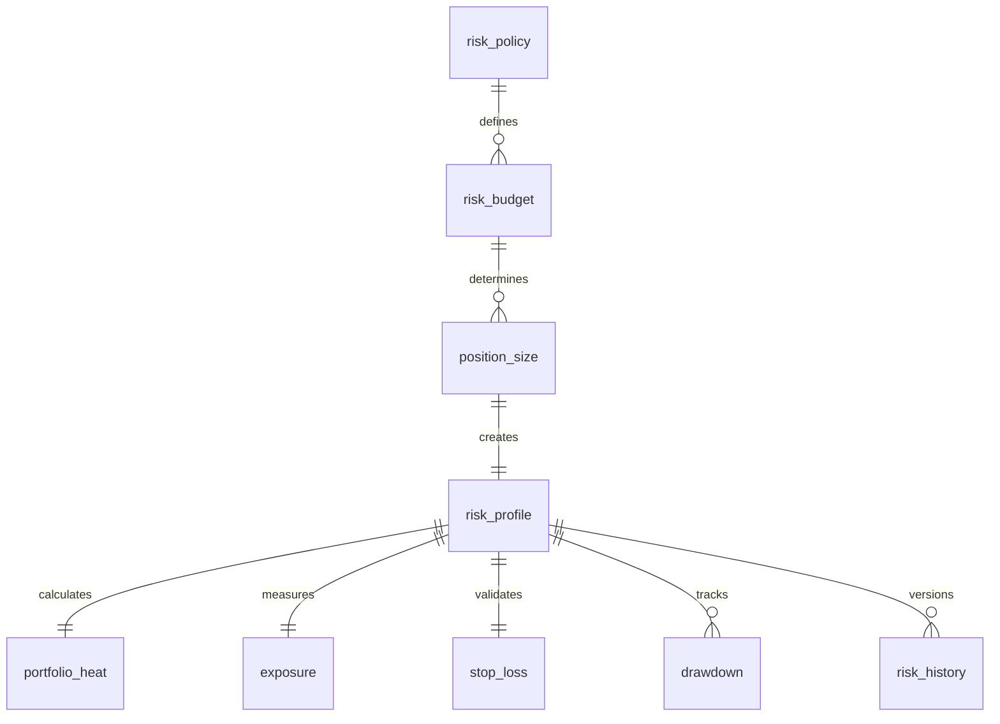

# ATHENA Risk Schema

> **Database schema specification for the Risk Intelligence Service**

---

| Property | Value |
|----------|-------|
| Schema | risk |
| Document | risk-schema.md |
| Version | 1.0.0 |
| Database | PostgreSQL 17+ |
| Owner | Risk Intelligence Service |

---

# Purpose

The **risk** schema stores all information related to capital
preservation and position risk.

Its primary objective is to determine:

- Position Size
- Capital Allocation
- Portfolio Heat
- Exposure
- Maximum Loss
- Risk Budget

The Risk Service never decides **whether** to trade.

It only determines **how much risk may be taken.**

---

# Responsibilities

The Risk Intelligence Service is responsible for:

- Position sizing
- Risk scoring
- Portfolio heat calculation
- Exposure monitoring
- Stop-loss validation
- Drawdown management
- Risk policy enforcement

---

# Workflow

```
Investment Case

↓

Validation Passed

↓

Risk Policies

↓

Position Size

↓

Risk Report

↓

Portfolio Service
```

---

# Schema Overview

```
risk

├── risk_profile
├── risk_policy
├── risk_budget
├── position_size
├── portfolio_heat
├── exposure
├── stop_loss
├── drawdown
├── risk_history
```

---

# Entity Relationship



---

# Table: risk_policy

## Purpose

Stores configurable risk rules.

Examples

- Swing Trading Policy
- Dividend Policy
- High Conviction Policy

---

## Columns

| Column | Type |
|----------|------|
| id | UUID |
| policy_name | VARCHAR(100) |
| max_position_pct | NUMERIC(5,2) |
| max_sector_exposure_pct | NUMERIC(5,2) |
| max_portfolio_heat_pct | NUMERIC(5,2) |
| max_drawdown_pct | NUMERIC(5,2) |
| active | BOOLEAN |
| created_at | TIMESTAMP |

---

# Table: risk_budget

## Purpose

Defines available risk capital.

---

## Columns

| Column | Type |
|----------|------|
| id | UUID |
| portfolio_id | UUID |
| policy_id | UUID |
| total_capital | NUMERIC(18,2) |
| available_risk | NUMERIC(18,2) |
| reserved_risk | NUMERIC(18,2) |
| calculated_at | TIMESTAMP |

---

# Table: position_size

## Purpose

Stores recommended position sizing.

---

## Columns

| Column | Type |
|----------|------|
| id | UUID |
| investment_case_id | UUID |
| capital_allocated | NUMERIC(18,2) |
| quantity | NUMERIC(18,4) |
| risk_per_trade | NUMERIC(6,2) |
| reward_risk_ratio | NUMERIC(6,2) |
| recommended | BOOLEAN |

---

# Table: risk_profile

## Purpose

Represents the overall risk assessment for an investment case.

---

## Columns

| Column | Type |
|----------|------|
| id | UUID |
| investment_case_id | UUID |
| risk_score | NUMERIC(5,2) |
| risk_grade | VARCHAR(10) |
| probability_adjustment | NUMERIC(5,2) |
| recommendation | VARCHAR(30) |
| created_at | TIMESTAMP |

---

## Risk Grades

- A
- B
- C
- D
- F

---

# Table: portfolio_heat

## Purpose

Tracks aggregate portfolio risk.

---

## Columns

| Column | Type |
|----------|------|
| id | UUID |
| portfolio_id | UUID |
| current_heat_pct | NUMERIC(5,2) |
| allowed_heat_pct | NUMERIC(5,2) |
| status | VARCHAR(30) |
| calculated_at | TIMESTAMP |

---

## Status

- SAFE
- WARNING
- CRITICAL

---

# Table: exposure

## Purpose

Measures exposure by category.

---

## Columns

| Column | Type |
|----------|------|
| id | UUID |
| portfolio_id | UUID |
| exposure_type | VARCHAR(50) |
| exposure_value | NUMERIC(18,2) |
| exposure_pct | NUMERIC(5,2) |

---

## Exposure Types

- Sector
- Industry
- Asset
- Strategy
- Market Cap

---

# Table: stop_loss

## Purpose

Stores stop-loss recommendations.

---

## Columns

| Column | Type |
|----------|------|
| id | UUID |
| investment_case_id | UUID |
| entry_price | NUMERIC(12,2) |
| stop_price | NUMERIC(12,2) |
| stop_distance_pct | NUMERIC(5,2) |
| stop_type | VARCHAR(30) |

---

## Stop Types

- Fixed
- ATR
- Trailing
- Time Based

---

# Table: drawdown

## Purpose

Tracks portfolio drawdown.

---

## Columns

| Column | Type |
|----------|------|
| id | UUID |
| portfolio_id | UUID |
| peak_value | NUMERIC(18,2) |
| current_value | NUMERIC(18,2) |
| drawdown_pct | NUMERIC(5,2) |
| measured_at | TIMESTAMP |

---

# Table: risk_history

## Purpose

Maintains historical changes.

---

## Columns

| Column | Type |
|----------|------|
| id | UUID |
| risk_profile_id | UUID |
| previous_score | NUMERIC(5,2) |
| new_score | NUMERIC(5,2) |
| reason | TEXT |
| changed_at | TIMESTAMP |

---

# Risk Formulae

## Position Size

```
Position Size

=

Maximum Risk Capital

/

Risk Per Share
```

---

## Portfolio Heat

```
Portfolio Heat

=

Σ Open Position Risk

/

Portfolio Capital
```

---

## Reward / Risk Ratio

```
Reward

/

Risk
```

---

## Maximum Capital Allocation

Default

```
5%

per position
```

Configurable through policy.

---

# Events Produced

- RiskCalculated
- PositionSizeCalculated
- PortfolioHeatUpdated
- ExposureUpdated
- DrawdownExceeded
- RiskLimitExceeded

---

# Materialized Views

```
mv_portfolio_heat

mv_sector_exposure

mv_risk_summary

mv_drawdown_history
```

---

# Partition Strategy

Monthly partition

Tables

```
risk_history

drawdown
```

---

# Estimated Growth

| Table | Growth |
|--------|---------|
| risk_policy | Low |
| risk_budget | Medium |
| position_size | High |
| risk_profile | High |
| portfolio_heat | High |
| exposure | High |
| stop_loss | High |
| drawdown | Very High |
| risk_history | Very High |

---

# Security

Write Access

- Risk Intelligence Service

Read Access

- Portfolio Service
- Knowledge Service
- Reporting
- AI Coach

---

# Sample Query

```sql
SELECT
    rp.risk_score,
    ps.capital_allocated,
    ph.current_heat_pct,
    sl.stop_price
FROM risk.risk_profile rp
JOIN risk.position_size ps
ON rp.investment_case_id = ps.investment_case_id
JOIN risk.portfolio_heat ph
ON ph.portfolio_id = ps.investment_case_id
JOIN risk.stop_loss sl
ON sl.investment_case_id = rp.investment_case_id
WHERE rp.risk_grade IN ('A','B');
```

---

# References

- validation-schema.md
- portfolio-schema.md
- DATABASE_ARCHITECTURE.md
- DOMAIN_SCHEMA_MAP.md
- EVENT_CATALOG.md

---

# Revision History

| Version | Date | Description |
|----------|------|-------------|
| 1.0.0 | July 2026 | Initial Risk Schema |

---

**End of Document**
