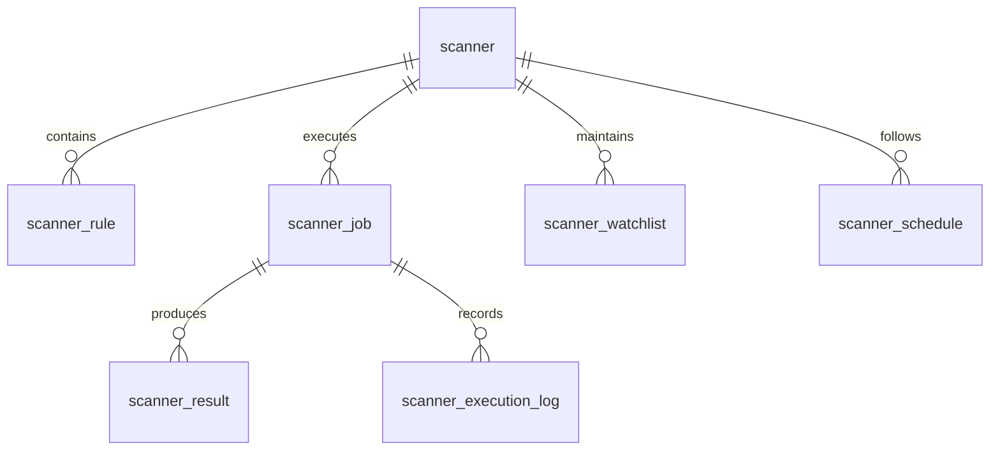

# ATHENA Scanner Schema

> **Database schema specification for the Scanner Intelligence Service**

---

| Property | Value |
|----------|-------|
| Schema | scanner |
| Document | scanner-schema.md |
| Version | 1.0.0 |
| Database | PostgreSQL 17+ |
| Owner | Scanner Intelligence Service |

---

# Purpose

The **scanner** schema stores all information related to opportunity
discovery.

It does not execute trades.

It identifies and ranks investment opportunities based on configurable
scanner rules.

This schema is optimized for high-frequency reads and frequent writes
during market hours.

---

# Responsibilities

The Scanner Service is responsible for:

- Executing scanner jobs
- Discovering opportunities
- Ranking opportunities
- Managing watchlists
- Recording scanner history
- Publishing SetupDetected events

---

# Schema Overview

```
scanner

├── scanner
├── scanner_rule
├── scanner_job
├── scanner_result
├── scanner_watchlist
├── scanner_schedule
├── scanner_execution_log
```

---

# Entity Relationship



---

# Table: scanner

## Purpose

Defines available scanners.

Examples

- Breakout Scanner
- EMA Pullback Scanner
- Dividend Scanner
- Momentum Scanner
- Relative Strength Scanner

---

## Columns

| Column | Type |
|----------|------|
| id | UUID |
| scanner_name | VARCHAR(100) |
| scanner_type | VARCHAR(50) |
| description | TEXT |
| enabled | BOOLEAN |
| priority | INTEGER |
| created_at | TIMESTAMP |
| updated_at | TIMESTAMP |

---

## Constraints

```
PRIMARY KEY(id)

UNIQUE(scanner_name)
```

---

# Table: scanner_rule

## Purpose

Stores configurable scanner rules.

Examples

- RSI > 60
- EMA20 > EMA50
- Volume > 2x Average

---

## Columns

| Column | Type |
|----------|------|
| id | UUID |
| scanner_id | UUID |
| rule_name | VARCHAR(100) |
| expression | TEXT |
| weight | NUMERIC(5,2) |
| enabled | BOOLEAN |
| created_at | TIMESTAMP |

---

## Foreign Key

```
scanner_id

↓

scanner.id
```

---

# Table: scanner_job

## Purpose

Represents one scanner execution.

One execution

↓

Many results

---

## Columns

| Column | Type |
|----------|------|
| id | UUID |
| scanner_id | UUID |
| started_at | TIMESTAMP |
| completed_at | TIMESTAMP |
| execution_status | VARCHAR(20) |
| total_symbols | INTEGER |
| opportunities_found | INTEGER |
| duration_ms | INTEGER |

---

## Indexes

```
idx_job_started_at

idx_job_status
```

---

# Table: scanner_result

## Purpose

Stores discovered opportunities.

This table is the bridge between

Scanner

↓

Setup Intelligence

---

## Columns

| Column | Type |
|----------|------|
| id | UUID |
| scanner_job_id | UUID |
| symbol | VARCHAR(20) |
| exchange | VARCHAR(20) |
| setup_type | VARCHAR(100) |
| scanner_score | NUMERIC(8,2) |
| confidence | NUMERIC(8,2) |
| detected_at | TIMESTAMP |
| feature_snapshot | JSONB |
| promoted_to_setup | BOOLEAN |

---

## Foreign Key

```
scanner_job_id

↓

scanner_job.id
```

---

## Indexes

```
idx_symbol

idx_setup_type

idx_detected_at

idx_score
```

---

# Table: scanner_watchlist

## Purpose

Stores symbols monitored by scanners.

---

## Columns

| Column | Type |
|----------|------|
| id | UUID |
| scanner_id | UUID |
| symbol | VARCHAR(20) |
| priority | INTEGER |
| active | BOOLEAN |
| added_at | TIMESTAMP |

---

# Table: scanner_schedule

## Purpose

Defines automatic scanner schedules.

Examples

- Pre-market
- Every 5 Minutes
- Hourly
- Market Close

---

## Columns

| Column | Type |
|----------|------|
| id | UUID |
| scanner_id | UUID |
| schedule_type | VARCHAR(50) |
| cron_expression | VARCHAR(100) |
| timezone | VARCHAR(50) |
| enabled | BOOLEAN |

---

# Table: scanner_execution_log

## Purpose

Detailed execution history.

Contains

- Start Time
- End Time
- CPU Usage
- Memory Usage
- Errors
- Rows Processed

---

## Columns

| Column | Type |
|----------|------|
| id | UUID |
| scanner_job_id | UUID |
| log_level | VARCHAR(20) |
| message | TEXT |
| execution_time_ms | INTEGER |
| created_at | TIMESTAMP |

---

# Workflow

```text
Market Data

↓

Scanner

↓

Scanner Rules

↓

Scanner Job

↓

Scanner Results

↓

Setup Intelligence
```

---

# Events Produced

- SetupDetected
- ScannerCompleted
- WatchlistUpdated

---

# Read Models

Materialized Views

```
mv_top_opportunities

mv_active_watchlist

mv_scanner_performance

mv_scanner_statistics
```

---

# Partition Strategy

Partition monthly

Tables

```
scanner_result

scanner_execution_log
```

---

# Estimated Growth

| Table | Growth |
|--------|---------|
| scanner | Static |
| scanner_rule | Low |
| scanner_job | High |
| scanner_result | Very High |
| scanner_watchlist | Medium |
| scanner_execution_log | Very High |

---

# Security

Write Access

- Scanner Intelligence Service

Read Access

- Setup Intelligence
- Probability Service
- Reporting
- AI Coach

---

# Sample Query

```sql
SELECT
    symbol,
    setup_type,
    scanner_score,
    confidence
FROM scanner.scanner_result
WHERE promoted_to_setup = FALSE
ORDER BY scanner_score DESC
LIMIT 20;
```

---

# References

- market-schema.md
- setup-schema.md
- FEATURE_STORE.md
- EVENT_CATALOG.md
- DOMAIN_SCHEMA_MAP.md

---

# Revision History

| Version | Date | Description |
|----------|------|-------------|
| 1.0.0 | July 2026 | Initial Scanner Schema |

---

**End of Document**
