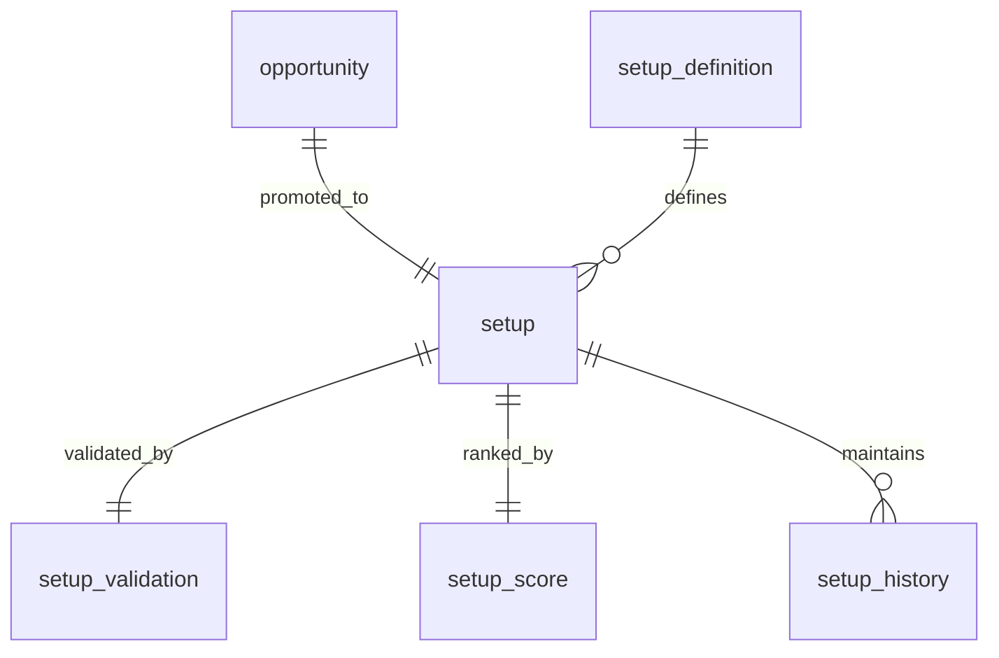

# ATHENA Setup Schema

> **Database schema specification for the Setup Intelligence Service**

---

| Property | Value |
|----------|-------|
| Schema | setup |
| Document | setup-schema.md |
| Version | 1.0.0 |
| Database | PostgreSQL 17+ |
| Owner | Setup Intelligence Service |

---

# Purpose

The **setup** schema transforms raw scanner outputs into validated,
ranked and standardized investment setups.

It acts as the quality gate between opportunity discovery and
probability analysis.

---

# Responsibilities

The Setup Intelligence Service is responsible for:

- Creating opportunities
- Validating scanner results
- Standardizing setup definitions
- Ranking opportunities
- Promoting opportunities into setups
- Publishing SetupValidated events

---

# Workflow

```
Scanner Result

↓

Opportunity

↓

Validation

↓

Ranking

↓

Setup

↓

Probability Service
```

---

# Schema Overview

```
setup

├── opportunity
├── setup
├── setup_definition
├── setup_validation
├── setup_score
├── setup_history
```

---

# Entity Relationship



---

# Table: opportunity

## Purpose

Stores normalized trading opportunities produced from scanner results.

An opportunity is **not yet an approved setup**.

---

## Columns

| Column | Type |
|----------|------|
| id | UUID |
| scanner_result_id | UUID |
| symbol | VARCHAR(20) |
| exchange | VARCHAR(20) |
| opportunity_type | VARCHAR(100) |
| discovery_time | TIMESTAMP |
| status | VARCHAR(30) |
| notes | TEXT |

---

## Status Values

- NEW
- UNDER_REVIEW
- PROMOTED
- REJECTED
- EXPIRED

---

## Indexes

```
idx_symbol

idx_status

idx_discovery_time
```

---

# Table: setup_definition

## Purpose

Defines reusable setup templates.

Examples

- EMA Pullback
- Breakout
- Trend Continuation
- Mean Reversion
- Dividend Accumulation

---

## Columns

| Column | Type |
|----------|------|
| id | UUID |
| setup_name | VARCHAR(100) |
| category | VARCHAR(50) |
| description | TEXT |
| minimum_score | NUMERIC(5,2) |
| active | BOOLEAN |

---

# Table: setup

## Purpose

Represents a validated investment setup.

---

## Columns

| Column | Type |
|----------|------|
| id | UUID |
| opportunity_id | UUID |
| setup_definition_id | UUID |
| symbol | VARCHAR(20) |
| timeframe | VARCHAR(20) |
| trend | VARCHAR(20) |
| entry_price | NUMERIC(12,2) |
| stop_loss | NUMERIC(12,2) |
| target_price | NUMERIC(12,2) |
| created_at | TIMESTAMP |

---

## Foreign Keys

```
opportunity_id

↓

opportunity.id
```

```
setup_definition_id

↓

setup_definition.id
```

---

# Table: setup_validation

## Purpose

Stores validation results before a setup is accepted.

---

## Columns

| Column | Type |
|----------|------|
| id | UUID |
| setup_id | UUID |
| liquidity_check | BOOLEAN |
| trend_check | BOOLEAN |
| volume_check | BOOLEAN |
| pattern_check | BOOLEAN |
| validation_score | NUMERIC(5,2) |
| validated_at | TIMESTAMP |

---

# Table: setup_score

## Purpose

Ranks validated setups.

---

## Columns

| Column | Type |
|----------|------|
| id | UUID |
| setup_id | UUID |
| technical_score | NUMERIC(5,2) |
| quality_score | NUMERIC(5,2) |
| opportunity_score | NUMERIC(5,2) |
| final_score | NUMERIC(5,2) |
| ranking | INTEGER |

---

# Table: setup_history

## Purpose

Maintains the lifecycle of every setup.

---

## Columns

| Column | Type |
|----------|------|
| id | UUID |
| setup_id | UUID |
| previous_status | VARCHAR(30) |
| current_status | VARCHAR(30) |
| changed_at | TIMESTAMP |
| changed_by | UUID |
| remarks | TEXT |

---

# Lifecycle

```
Scanner Result

↓

Opportunity

↓

Validated

↓

Ranked

↓

Approved Setup

↓

Probability

↓

Archived
```

---

# Events Produced

- OpportunityCreated
- OpportunityRejected
- SetupValidated
- SetupPromoted
- SetupExpired

---

# Materialized Views

```
mv_active_setups

mv_top_ranked_setups

mv_setup_success_rate

mv_setup_statistics
```

---

# Partition Strategy

Monthly partition

Tables

```
setup_history
```

---

# Estimated Growth

| Table | Growth |
|--------|---------|
| opportunity | Very High |
| setup | High |
| setup_validation | High |
| setup_score | High |
| setup_history | Very High |

---

# Security

Write Access

- Setup Intelligence Service

Read Access

- Probability Service
- Decision Service
- Reporting
- AI Coach

---

# Sample Query

```sql
SELECT
    s.symbol,
    d.setup_name,
    sc.final_score,
    s.entry_price
FROM setup.setup s
JOIN setup.setup_definition d
ON s.setup_definition_id = d.id
JOIN setup.setup_score sc
ON s.id = sc.setup_id
WHERE sc.final_score >= 80
ORDER BY sc.final_score DESC;
```

---

# References

- scanner-schema.md
- probability-schema.md
- FEATURE_STORE.md
- EVENT_CATALOG.md
- DOMAIN_SCHEMA_MAP.md

---

# Revision History

| Version | Date | Description |
|----------|------|-------------|
| 1.0.0 | July 2026 | Initial Setup Schema |

---

**End of Document**
