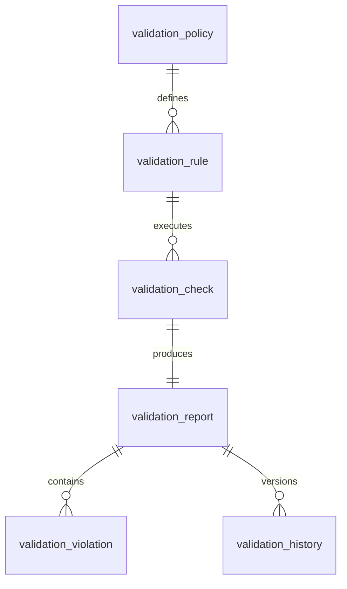

# ATHENA Validation Schema

> **Database schema specification for the Validation Intelligence Service**

---

| Property | Value |
|----------|-------|
| Schema | validation |
| Document | validation-schema.md |
| Version | 1.0.0 |
| Database | PostgreSQL 17+ |
| Owner | Validation Intelligence Service |

---

# Purpose

The **validation** schema stores all validation rules,
validation results and approval records used to determine whether an
investment decision is eligible for execution.

Validation is independent of decision making.

It ensures every recommendation satisfies technical,
risk, portfolio and policy requirements.

---

# Responsibilities

The Validation Service is responsible for:

- Validating investment decisions
- Executing validation rules
- Recording validation evidence
- Maintaining validation history
- Producing approval decisions
- Publishing validation events

---

# Workflow

```
Investment Case

↓

Validation Rules

↓

Validation Checks

↓

Validation Report

↓

Approval

↓

Risk Service
```

---

# Schema Overview

```
validation

├── validation_rule
├── validation_check
├── validation_report
├── validation_violation
├── validation_history
├── validation_policy
```

---

# Entity Relationship



---

# Table: validation_policy

## Purpose

Defines reusable validation policies.

Examples

- Swing Trading Policy
- Dividend Policy
- High Risk Policy

---

## Columns

| Column | Type |
|----------|------|
| id | UUID |
| policy_name | VARCHAR(100) |
| description | TEXT |
| version | INTEGER |
| active | BOOLEAN |
| created_at | TIMESTAMP |

---

# Table: validation_rule

## Purpose

Stores individual validation rules.

Examples

- Liquidity ≥ Minimum
- Risk Score ≤ Threshold
- Market Open
- Earnings Window Check

---

## Columns

| Column | Type |
|----------|------|
| id | UUID |
| policy_id | UUID |
| rule_name | VARCHAR(150) |
| rule_type | VARCHAR(50) |
| severity | VARCHAR(20) |
| expression | TEXT |
| enabled | BOOLEAN |

---

## Rule Types

- Market
- Technical
- Liquidity
- Portfolio
- Risk
- Compliance
- Time

---

## Severity

- Critical
- High
- Medium
- Low

---

# Table: validation_check

## Purpose

Stores execution results for every validation rule.

---

## Columns

| Column | Type |
|----------|------|
| id | UUID |
| investment_case_id | UUID |
| validation_rule_id | UUID |
| result | BOOLEAN |
| actual_value | VARCHAR(100) |
| expected_value | VARCHAR(100) |
| executed_at | TIMESTAMP |

---

# Table: validation_report

## Purpose

Represents the complete validation result.

---

## Columns

| Column | Type |
|----------|------|
| id | UUID |
| investment_case_id | UUID |
| overall_status | VARCHAR(30) |
| validation_score | NUMERIC(5,2) |
| total_checks | INTEGER |
| passed_checks | INTEGER |
| failed_checks | INTEGER |
| critical_failures | INTEGER |
| validated_at | TIMESTAMP |

---

## Status Values

- APPROVED
- REJECTED
- REVIEW_REQUIRED

---

# Table: validation_violation

## Purpose

Stores rule violations.

---

## Columns

| Column | Type |
|----------|------|
| id | UUID |
| validation_report_id | UUID |
| validation_rule_id | UUID |
| severity | VARCHAR(20) |
| message | TEXT |
| recommendation | TEXT |

---

# Table: validation_history

## Purpose

Tracks every validation run.

---

## Columns

| Column | Type |
|----------|------|
| id | UUID |
| validation_report_id | UUID |
| previous_status | VARCHAR(30) |
| current_status | VARCHAR(30) |
| changed_at | TIMESTAMP |
| changed_by | UUID |
| reason | TEXT |

---

# Validation Categories

ATHENA validates:

## Market

- Trading session
- Market regime
- Circuit breaker
- Volatility

---

## Liquidity

- Average volume
- Bid/Ask spread
- Delivery percentage

---

## Portfolio

- Position limits
- Sector exposure
- Cash availability
- Diversification

---

## Risk

- Position size
- Stop-loss
- Portfolio heat
- Maximum drawdown

---

## Compliance

- Trading restrictions
- User permissions
- Policy adherence

---

## Time

- Earnings window
- Corporate actions
- Trading holidays

---

# Events Produced

- ValidationStarted
- ValidationPassed
- ValidationFailed
- ValidationReportCreated
- ValidationRuleViolated

---

# Materialized Views

```
mv_validation_summary

mv_validation_failures

mv_policy_statistics

mv_rule_performance
```

---

# Partition Strategy

Partition monthly

Tables

```
validation_history

validation_check
```

---

# Estimated Growth

| Table | Growth |
|--------|---------|
| validation_policy | Low |
| validation_rule | Low |
| validation_check | Very High |
| validation_report | High |
| validation_violation | Medium |
| validation_history | Very High |

---

# Security

Write Access

- Validation Intelligence Service

Read Access

- Risk Service
- Portfolio Service
- Knowledge Service
- Reporting
- AI Coach

---

# Sample Query

```sql
SELECT
    vr.overall_status,
    vr.validation_score,
    vr.failed_checks,
    vv.message
FROM validation.validation_report vr
LEFT JOIN validation.validation_violation vv
ON vr.id = vv.validation_report_id
WHERE vr.overall_status = 'REJECTED';
```

---

# References

- decision-schema.md
- risk-schema.md
- EVENT_CATALOG.md
- DOMAIN_SCHEMA_MAP.md
- DATABASE_ARCHITECTURE.md

---

# Revision History

| Version | Date | Description |
|----------|------|-------------|
| 1.0.0 | July 2026 | Initial Validation Schema |

---

**End of Document**
